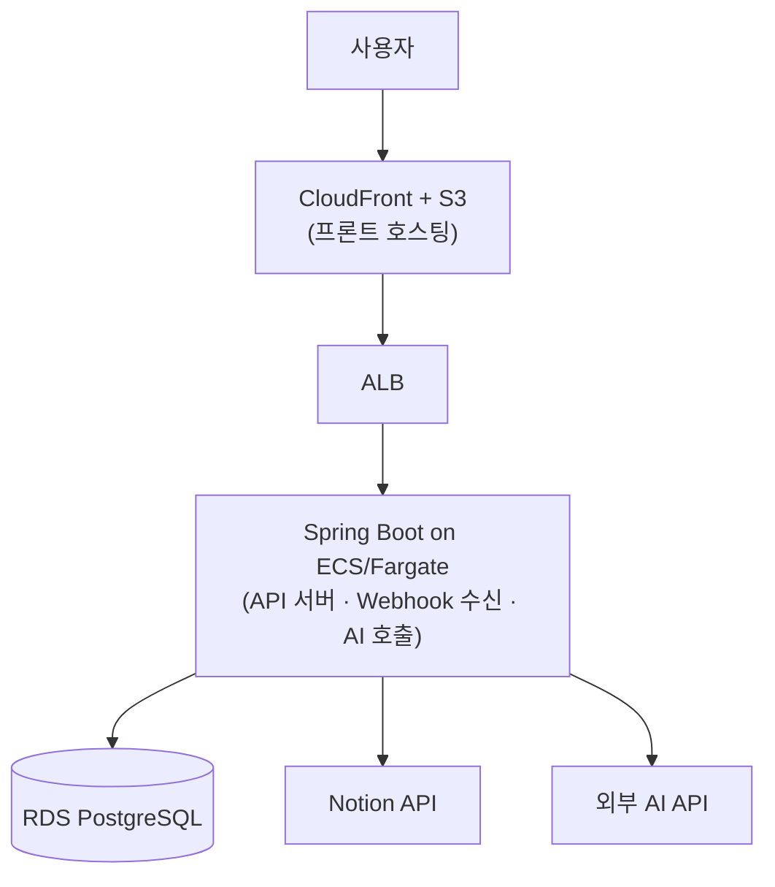

# DocGraph 아키텍처 설계

## 전체 아키텍처

DB 비밀번호·AI API 키·Notion OAuth 앱 자격증명은 Secrets Manager에서 관리하고, 사용자별 Notion OAuth 토큰은 RDS에 암호화 저장한다.

## 기술 스택

| 레이어 | 기술 | 비고 |
| --- | --- | --- |
| 프론트엔드 | React (TypeScript) | S3 + CloudFront 배포 |
| API 서버 + Webhook + AI 호출 | Kotlin, Spring Boot 4, Java 21 | Docker 컨테이너화, ECS/Fargate 배포 |
| DB | RDS PostgreSQL 17 + pg_trgm | 유사도 검색: 키워드 매칭 |
| API 명세 | springdoc-openapi (OpenAPI 3.1) | TS 타입 자동 생성 |
| 문서 소스 | Notion API (OAuth) + Webhook | 페이지 변경 이벤트 수신 |
| 알림 | 인앱 표시 + Webhook (Slack/Discord 등) | Webhook URL 프로젝트별 설정 |
| 자격증명 관리 | Secrets Manager | DB 비밀번호, AI API 키, Notion OAuth 앱 자격증명 |

## 미확정 사항

- AI API 공급자 (OpenAI / Claude API / 기타)
- 프론트엔드 그래프 시각화 라이브러리 (D3.js / React Flow 등)
